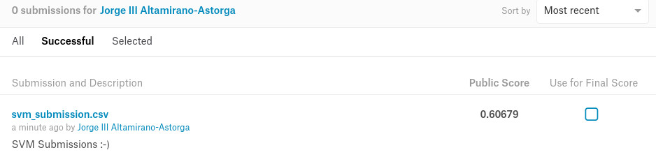

_175904 - Jorge III Altamirano Astorga_

_177508 - Uriel Miranda Miñón_

```{r libs, include=FALSE}
library(plyr)
library(tidyverse)
library(jsonlite)
library(glmnet)
library(rpart)
library(rpart.plot)
library(randomForest)
library(doParallel)
registerDoParallel(cores=detectCores()-1)
library(parallelSVM)
library(gridExtra)
```

# {.tabset}

## Load 

Se cargan los datos originales en formato JSON y se separan datos de entrenamiento y validación; existe además forma de datos de prueba adicionales en la prueba de Kaggle. :-)

```{r import}
set.seed(175904)
train_raw <- fromJSON("data/train.json") 
train_raw <- train_raw %>% as.data.frame
train_raw$train <- F
train_raw[sample(nrow(train_raw), nrow(train_raw)*.7, replace = F), 4] <- T
train <- train_raw[train_raw$train == T,1:3]
valid <- train_raw[train_raw$train == F,1:3]
train_2 <- train
valid_2 <- valid

ggplot(train_raw, aes(x=train)) +
  geom_histogram(stat="count")
```

## Cleaning {.tabset}

Se limpian los datos de palabras que consideramos que no añaden valor a la predicción. De los cuales consideramos

* Gentilicios: mexican, italian, greek, parma, ...
* Onzas, small, warm, hot, rich, ...
* Formas: minced, cubed, smoked, unflavored, unsalted, light, heavy, low-fat, ...
* Variantes: toasted, young, fresh, ...
* Marcas: Oscar Mayer, Kraft, Velveeta, Everglades, ...

Así mismo se condensaron los datos por palabras clave, los cuales consideramos ordinales en importancia:

1. Vegetales: beans, lettuce, potato(es), lemon, ...
1. Derivados animales: tipos de queso, tipos de embutido, huevos, leche de coco, crema, ...
1. Proteínas: stock, beef, pork, chicken, oyster
1. Especias: sal, curry, ajo, ...

Ejemplo de condensación de datos:

* Lemon zest -> lemon
* roasted beef -> beef
* chicken broth -> chicken

Todo esto derivado de estudiar el dataset con el fin de reducir el número de variables.

Por último sacamos las frecuencias y eliminamos los datos con $n$ ocurrencias, en nuestro caso determinamos los suficientes para tener alrededor de 100 variables.

### Limpieza

```{r clean_ingredients, cache=TRUE}
unimportant_words <- "(^a taste of|any|low-fat|low ?salt|all|powder|baby|bertolli|boiled|boiling|bone in|whole|boneless|bottled|sauvignon|california|campbells condensed|canned|chopped|flavored carbonated beverage|cold|condensed|cooked|cooking|cereal|lowfat|frosting|spread|soften|with chives.*|ic peach| of .*|creamed|creamy| mexican.?|crushed|crystal farms|shredded|crystallized|crystal hot|cubed|curly|curlyleaf|jelly|dessert mix|sauce mix|mix|dark|dellallo|deepfried|deep fried|diced|diet|tortilla chips||domino|dried|minced|dry|earth balance|elmlea|^english|evaporated|everglades|extra fine|extra firm|extra large|extra\\s?lean|extra light|extra sharp|extra\\s?virgin|extra wide|^fat|fat\\s?free|fat skimmed|fatfree?|fattrimmed|fine|firm|firmly packed|flat |^flavored|terrine|food|free\\s?range|^french|^fresh| root|^fresno|^fried|^frozen|^fuji|full\\s?fat|gluten\\s?free|s milk |^gold|golden|gourmet|graham|granulated|grassfed|grated|grating|gravenstein|great|greater|style|green|grilled|grill|ground|half|heavy|heinz|hellmanns?|of the woods|herbed |herdez|hidden valley|homemade|^hot |hot smoked|hot spanish|^hungarian|hurst|i cantbelieve? its? not butter|imitation|imperial sugar light brown|instant |^irish|^italian|italianstyle|^japanese |jimmy dean|johnsonville|jose cuervo|jumbo|kikkoman|knorr|knudsen|kraft|mexican style|kraft zesty|slim cut|sun dried|shredded|la victoria|land o lakes|^large|^lean|leftover|leg of|zest|less sodium|lesser|leaves|^light|cook and drain|lipton|liquid |^lite|^long |loosely packed fresh|low fat|lowfat|^low sodium|lower sodium|lowfat|baked|\\sdeli|firm silken|styl|lowsodium|and cheese dinner|madagascar bourbon|extract|mccormick|^medium|uncook|uncooked|merguez|^mexican|minced|mini|mini|mixed|mixture|mizkan|^mms|mrs dash|natural|^nido|non dairy|non fat|non stick|nondairy|nonfat|frozen|nonhydrogenated|nosaltadded|old el paso|old|old\\s?fashioned|cooking spray|flavored|^organic|oscar mayer|other|oven\\s?ready|flavor|flavour|paella|reggiano|peeled|^petite|pillsbury|powdered|prepared|preserv|preserved|progresso|\\sdi\\sparma|pt|pte|puff|puffed|pure|quickcooking|quick|cooking|raw|red|reduced\\sfat|reduced\\ssodium|reduced\\ssugar|reducedfat|reducedsodium|reducedsugar|refrigerated|regular|rich|roasted|roast|roasting|robert mondavi|salt free seasoning|salt free chili powder|salt free cajun creole seasoning|salt free southwest chipotle seasoning|salt free herb seasoning|salt free chili powder|salted|saltines?|saltpeper|san marazano|sargento|links|casings|savoy|seafood|seasoned|seasoning|seedless|self ?ra?ising|shredded|single|simple|skinless|sliced|small|smoked|sodium free|sodium reduced|soft|softened|solid|southern comfort.*|southwest|sparkling|spicy|splenda.*|split|spring water|^strip|superfine|sweetened|taco bell.*|into serving pieces|to\\s+lb|toasted|uncle bens|^uncook|^uncooked|unflavou?red|unsweetened|white|wholesome sweeteners|wholemilk|wide|^wild|^winter|wish\\s?bone|yellow|young|zesty|part ?skim|italian|all ?purpose|puree|juice|aged|tuna in water|liqueur|liquor|^asian|and .*|yoplait|greek|fresh|spray|hot water|warm water|crumbles|freshly|flakes?|unsalt|unsalted|wedges?|plain)(\\s|$)"
popular_words <- function(a){
  a <- gsub("(.*)(beans?|lettuce|olives?|tabasco|potato(es)?|cilantro|wheat|shiitake|lemon|chives?|tomato(es)?|cabbage|peanut|yogh?o?urt|rice|onions?|ginger|sesame|jalapeno|stock|bacon|monterey_jack|vinegar|sausages?|mozz?arell?a|monterey_jack|feta|ricotta|dijon|masala|eggs?|coconut_milk|cheddar|dijon|parmesan|sour_(crema|cream)|steak|pork|beef|chicken|oyster|garlic|salt|curry).*", "\\2", a)
}

#limpiar datos de ingredientes
train_2$ingredients <- sapply(1:nrow(train), function(x) {
  train[x,3] %>% 
    unlist %>%
    tolower %>%
    gsub("\\([^)]*\\)", "", ., perl = T, ignore.case = T) %>%
    gsub("[^ a-z]", "", ., perl = T, ignore.case = T) %>%
    gsub("^\\s+", " ", ., perl = T, ignore.case = T) %>%
    gsub(unimportant_words, " ", ., perl = T, ignore.case = T) %>%
    gsub("\\s+", " ", ., perl = T, ignore.case = T) %>%
    unique %>%
    trimws %>%
    gsub("\\s", "_", ., perl = T, ignore.case = T) %>%
    popular_words
})

#limpiar los datos de validación
valid_2$ingredients <- sapply(1:nrow(valid), function(x) {
  valid[x,3] %>% 
    unlist %>%
    tolower %>%
    gsub("\\([^)]*\\)", "", ., perl = T, ignore.case = T) %>%
    gsub("[^ a-z]", "", ., perl = T, ignore.case = T) %>%
    gsub("^\\s+", " ", ., perl = T, ignore.case = T) %>%
    gsub(unimportant_words, " ", ., perl = T, ignore.case = T) %>%
    gsub("\\s+", " ", ., perl = T, ignore.case = T) %>%
    unique %>%
    trimws %>%
    gsub("\\s", "_", ., perl = T, ignore.case = T) %>%
    popular_words
})

train_2$cuisine <- train_2$cuisine %>% as.factor
valid$cuisine <- valid$cuisine %>% as.factor

ingredients <- train_2$ingredients %>% 
  unlist 
ingredients <- ingredients[which(!grepl(pattern = "^$", x = ingredients))] #%>%
#    unique
ingredients %>% head(n=10)

ingredients_df <- as.data.frame(ingredients, stringsAsFactors = F) %>%
  group_by(ingredients)

ingredients_count <- ingredients_df %>% 
  plyr::count(.) %>%
  arrange(freq)
ingredients_count$id <- 1:nrow(ingredients_count)
head(ingredients_count)
tail(ingredients_count)
ingredients_top <- ingredients_count %>% 
  filter(freq > 150) %>% 
  arrange(desc(freq)) %>% 
  select(ingredients)
```

### Variables

```{r feature-creation, cache=TRUE}
train_3 <- train_2[,1:2]
valid_3 <- valid_2[,1:2]
#crea las columnas
train_3[, ingredients_top %>% unlist] <- 0
valid_3[, ingredients_top %>% unlist] <- 0
#llena las columnas
for(i in 1:nrow(train_3)){
  train_3[i, which(names(train_3) %in% (train_2[i,]$ingredients %>% unlist))] <- 1
}
for(i in 1:nrow(valid_3)){
  valid_3[i, which(names(valid_3) %in% (valid_2[i,]$ingredients %>% unlist))] <- 1
}
rm(i)
saveRDS(train_2, "data/train_2.rds")
saveRDS(train_3, "data/train_3.rds")
saveRDS(valid_2, "data/valid_2.rds")
saveRDS(valid_3, "data/valid_3.rds")
# train_2 <- readRDS("data/train_2.rds")
# train_3 <- readRDS("data/train_3.rds")
# valid_2 <- readRDS("data/valid_2.rds")
# valid_3 <- readRDS("data/valid_3.rds")
train_3 %>% 
  select(id,cuisine,garlic,salt,pepper) %>%
  head(n=5)
valid_3 %>% 
  select(id,cuisine,garlic,salt,pepper) %>%
  head(n=5)
```


## EDA {.tabset}

### Frecuencias de ingredientes

```{r}
ggplot(ingredients_count %>% filter(freq > 100),aes(x=id, y=log(freq)))+geom_line() + 
  theme(axis.text.x = element_text(angle = 90, hjust = 1)) 
```

### Número de ingredientes por tipo de cocina

```{r}
n_ing <- train_2$ingredients
# a_ing <- 
train_2$n_ing <- sapply(1:length(n_ing),function(i){length(n_ing[[i]])})
ggplot(train_2 , aes(x=cuisine,y=n_ing)) +
  geom_boxplot() +
  theme(axis.text.x=element_text(angle=90,hjust=1))
rm(n_ing)
```

### Stats

```{r}
data.frame( Cuisine = unique(train_2$cuisine), 
                       Mean = aggregate(train_2$n_ing, list(train_2$cuisine), mean)[,2],
                       SD = aggregate(train_2$n_ing, list(train_2$cuisine), sd)[,2],
                       Min = aggregate(train_2$n_ing, list(train_2$cuisine), min)[,2],
                       Max = aggregate(train_2$n_ing, list(train_2$cuisine), max)[,2])
```

### Frecuencias de ingredientes por cocina

```{r}
ggplot(train_2, aes(n_ing, group = cuisine)) + 
    geom_bar(aes(y = ..prop.., fill = factor(..x..)), stat="count") + 
    scale_y_continuous(labels=scales::percent) +
    ylab("relative frequencies") +
    facet_wrap(~cuisine)
```

### Casos por cocina

Vemos que la cocina mexicana es una cocina muy popular. :-)

```{r}
ggplot((train_2$cuisine %>% plyr::count()), aes(x = reorder(x, -freq), y = freq)) +
  geom_bar(stat = "identity") +
  xlab("Cuisine") +
  ylab("Frecuencias") +
  theme(axis.text.x=element_text(angle=90,hjust=1))
```

### Ingredientes por cocina

```{r}
train_2 <- readRDS("data/train_2.rds")
ingredients_count <- readRDS("data/ingredients_count.Rdata")
ingredients_graph <- train_2 %>% 
  unnest

top_ing <- ingredients_count[(nrow(ingredients_count)-100):nrow(ingredients_count),]

ggplot(ingredients_graph[ingredients_graph$ingredients %in% top_ing$ingredients,], aes(x = ingredients, fill = cuisine)) + geom_histogram(stat = "count" ) + theme(axis.text.x=element_text(angle=90,hjust=1))
```


## Models {.tabset}

### Árbol

Predice súmamente mal, incluso con el conjunto de entrenamiento. Debido a esto, exploramos otros algoritmos.

```{r, cache=TRUE}
# arbol_grande <- rpart(cuisine ~ ., data= train_3[,-1], cp=0)
# save(arbol_grande, file = "data/arbol.Rdata")
load(file = "data/arbol.Rdata")
prp(prune(arbol_grande, cp=0.03), type=4, extra=1, digits=3) 
```

```{r, cache=TRUE}
train_3$arbol <- predict(arbol_grande, newdata = train_3[,3:210], type="class")
train_3 %>% mutate(arbol_pred = (cuisine == arbol)) %>% select(arbol_pred) %>% summary
train_3 %>% select(cuisine, arbol)
```

### Bosques Aleatorios

```{r, cache=TRUE}
# bosque <- foreach(ntree=rep(150, 3), .combine=combine, .multicombine=TRUE,
#               .packages='randomForest') %dopar% {
#     randomForest(cuisine ~ . , data = train_3[,2:210], ntree=ntree)
#               }
# save(bosque, file="data/bosque.Rdata")
load("data/bosque.Rdata")
```

#### Entrenamiento 

```{r, cache=TRUE}
train_3$bosque <- predict(bosque, newdata = train_3[,3:210], type="class")
train_3 %>% mutate(bosque_pred = (cuisine == bosque)) %>% select(bosque_pred) %>% summary
train_3 %>% select(cuisine, bosque)
```

#### Validación

```{r}
load("data/bosque.Rdata")
valid_3$bosque <- predict(bosque, newdata = valid_3[,3:210], type="class")
valid_3 %>% mutate(bosque_pred = (cuisine == bosque)) %>% select(bosque_pred) %>% summary
valid_3 %>% select(cuisine, bosque)
```

### SVM

```{r, cache=TRUE}
# set.seed(175904)
# svm <- parallelSVM(cuisine ~ . , data = train_3[,2:210], 
#             numberCores = detectCores()-1,
#             samplingSize = 0.2, 
#             na.action = na.omit, 
#             scale = TRUE)
# save(svm, file = "data/svm.Rdata")
load(file = "data/svm.Rdata")
```

#### Entrenamiento

```{r, cache=TRUE}
train_3$svm <- predict(svm, newdata = train_3[,3:210], type="class")
train_3 %>% mutate(svm_pred = (cuisine == svm)) %>% select(svm_pred) %>% summary
train_3 %>% select(cuisine, svm)
```

#### Validación

```{r, cache=TRUE}
# valid_3 <- readRDS("data/valid_3.rds")
# load(file = "data/svm.Rdata")
valid_3$svm <- predict(svm, newdata = valid_3[,3:210], type="class")
valid_3$bosque <- predict(bosque, newdata = valid_3[,3:210], type="class")
valid_3 %>% mutate(svm_pred = (cuisine == svm)) %>% select(svm_pred) %>% summary
valid_3 %>% select(cuisine, svm)
```

### Comparación

```{r}
valid_3a <- valid_3%>%select(cuisine,svm,bosque)
valid_3a <- valid_3a %>% group_by(cuisine) %>% mutate("bosque" = (cuisine == bosque))
valid_3a <- valid_3a %>% group_by(cuisine) %>% mutate("svm" = (cuisine == svm))
data_valid <- summarise(valid_3a, 
                        bosque=mean(bosque), svm=mean(svm))
g1 <- ggplot(data_valid , aes(x=reorder(cuisine, -bosque), y=bosque)) + 
  geom_bar(stat="identity") + xlab("cuisine") +
  theme(axis.text.x = element_text(angle = 90, hjust = 1)) 
g2 <- ggplot(data_valid , aes(x=reorder(cuisine, -svm), y=svm)) + 
  geom_bar(stat="identity") + xlab("cuisine") +
  theme(axis.text.x = element_text(angle = 90, hjust = 1))
grid.arrange(g1,g2)
```

```{r}
glimpse(valid_3)
```

#### Kaggle Submission

```{r}
test_raw <- fromJSON("data/test.json") 
test_raw <- test_raw %>% as.data.frame
test <- test_raw
# test_raw$ingredients %>% unlist
test$ingredients <- sapply(1:nrow(test_raw), function(x) {
  test[x,2] %>% 
    unlist %>%
    tolower %>%
    gsub("\\([^)]*\\)", "", ., perl = T, ignore.case = T) %>%
    gsub("[^ a-z]", "", ., perl = T, ignore.case = T) %>%
    gsub("^\\s+", " ", ., perl = T, ignore.case = T) %>%
    gsub(unimportant_words, " ", ., perl = T, ignore.case = T) %>%
    gsub("\\s+", " ", ., perl = T, ignore.case = T) %>%
    unique %>%
    trimws %>%
    gsub("\\s", "_", ., perl = T, ignore.case = T) %>%
    popular_words
})
test
```

```{r}
test_2 <- test[,1] %>% data_frame(id=.)
#crea las columnas
test_2[, ingredients_top$ingredients] <- 0
#llena las columnas
for(i in 1:nrow(test_2)){
  test_2[i, which(names(test_2) %in% (test[i,]$ingredients %>% unlist))] <- 1
}
test_2
```

```{r, cache=TRUE}
test_2$cuisine <- predict(svm, newdata = test_2[,1:209], type="class")
test_2 %>% select(id,cuisine) %>% summary
test_2 %>% select(id, cuisine) %>% write_csv(., "data/svm_submission.csv")
```

Kaggle Submission :-(




## Bibliografía

* [ParallelSVM](https://cran.r-project.org/web/packages/parallelSVM/parallelSVM.pdf)
* [doParallel](https://cran.r-project.org/web/packages/doParallel/vignettes/gettingstartedParallel.pdf)
* [StackOverflow: Speedup Random Forests](https://stackoverflow.com/questions/7830255/suggestions-for-speeding-up-random-forests/7831848#7831848)
* [StackOverflow: Parallelizing RF](https://stackoverflow.com/questions/37213279/parallelizing-random-forests)
