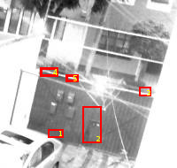
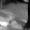
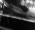

## Código Inicial
_175904 - Jorge III Altamirano Astorga (phil_websurfer@yahoo.com)_

```{r libraries, echo=TRUE, error=FALSE, message=FALSE, warning=FALSE}
library(readr)
library(dplyr)
library(glmnet)
library(imager)
library(purrr)
library(ggplot2)
library(ROCR)
```

### Preparación de los datos

Con el fin de acelerar las lecturas e ingesta en R se precargan las columnas. El método reproducible lo hice en un script bash `col_types.sh`.

```{r leer tablas}
### Toma mucho tiempo por lo que se opta por guardar los objetos
  # col_types <- read_file("col_types.out")
  # df_train <- read_csv('train.csv', col_types = col_types, progress=F)
  # 
  # # Cambiar la última columna donde el estado se convierte en ID
  # col_types <- sub(pattern = "cT", replacement = "Ti", x = col_types)
  # df_test <- read_csv('test.csv', col_types = col_types, progress = F)
  # rm(col_types)
  # save(df_train, file = "df_train.Robj")
  # save(df_test, file = "df_test.Robj")

load(file = "df_train.Robj")
load(file = "df_test.Robj")
```

```{r}
table(df_train$estado)
```

## EDA

### Minuto del día, en vez de tipo "DateTime"

```{r rango de datos}
summary(df_train$hora)
summary(df_test$hora)
```


Considero que para nuestro análisis va a servir mejor si utilizamos los minutos del día dado que no hay estacionalidad al ser todas las muestras entre julio y agosto, aunque todo está en UTC.

```{r minutes conversion}
df_train$minutes <- (df_train[,38002]%>% 
  mutate(minutes = 60*as.integer(format(hora, format = '%H')) + 
           as.integer(format(hora, format = '%M'))))[,2]
df_train$minutes <- df_train$minutes$minutes
summary(df_train[,c(1,38000,38003)])
df_test$minutes <- (df_test[,c(38001)]%>% 
  mutate(minutes = 60*as.integer(format(hora, format = '%H')) + 
           as.integer(format(hora, format = '%M'))))[,2]
df_test$minutes <- df_test$minutes$minutes
summary(df_test[,c(1,38000,38003)])
hist(df_train$minutes)
hist(df_test$minutes)
# mutate(minutes = 60*as.integer(format(df_test$hora, format = "%H")) +
#   as.integer(format(df_test$hora, format = "%M")))
```

```{r sample image}
mostrar_imagen <- function(renglon, dat, nrow = 190, ncol = 200){
  # head -n 1 train.csv | tr ',' '\n' | awk '{printf("%010d %s\n", NR, $0)}' | less
  v <- as.numeric(dat[renglon,c(1:(nrow*ncol))])
  mat <- (t(matrix(v, nrow=nrow, ncol=ncol, byrow=T))[,nrow:1])
  image(mat, axes = F, col=gray(0:255/255))
}


mostrar_imagen(2, df_train, 190, 200)
df_train[2,38001]
```

#### Conversión de imágenes
```{r Conversión de imágenes a archivos}
convertir_imagen <- function(renglon, dat, nrow = 200, ncol = 190) {
# Usage: convertir_imagen(2, df_train)
  mat <- (t(matrix(as.numeric(dat[renglon,c(1:(nrow*ncol))]),
                   nrow=ncol, ncol=nrow, byrow=T))[,1:ncol])
  imagen <- as.cimg(mat)
  if(names(dat[1,38001]) == "estado") {
    filename <- paste0("tmp/",substitute(dat),"-",renglon,"-",dat[renglon,38001],".jpg")
  } else{
    filename <- paste0("tmp/",substitute(dat),"-",renglon,".jpg")
  }
  save.image(imagen, filename)
}

# # Comentado para evitar correr las conversiones lentas
# for(i in 1:nrow(df_train)) {
#   convertir_imagen(i, df_train)
# }
# for(i in 1:nrow(df_test)) {
#   convertir_imagen(i, df_test)
# }
# rm(i)
```

### Hallazgos importantes

Encontré los siguientes hallazgos durante la exploración:

* La cámara al parecer se mueve ligeramente, por lo que el mismo pixel no representa la misma posición siempre
* No está sujeta a grandes cambios de estaciones los datos de aprendizaje, por lo que la hora (o minutos) pudieran tomarse como variable importante dentro del modelo, para compensar la luz y oscuridad
* Ciertas personas y objetos (como autos) pueden afectar al modelo, por lo que es importante tomar diferentes secciones de la imagen
* Existe un foco que pudiera afectar la interpretación del estado de la puerta, pues es _relativamente independiente_ al estado de la puerta. Pues se prende antes de abrir la puerta, durante la apertura, durante el cierre y después del cierre de la puerta; además no está prendida durante el día o no se aprecia.

### Sacar las columnas de las secciones relevantes

Crée una función sencilla para extraer secciones que yo considero relevantes para el aprendizaje y promediarlos.



Función para extraer las columnas de la subsección
```{r secciones de la imagen}
submatrix <- function(x = 0, y = 0, xoffset = 0, yoffset = 0, nrow = x) {
  a = NULL
  for(i in 1:y) {
    for(j in 1:x) {
      a = c(a,(xoffset+j)+(nrow*(i+yoffset-1)))
    }
  }
  a
}
submatrix(2,5,2,2)
submatrix(3,2,3,1,6)

convertir_imagen2 <- function(dat, nrow = 200, ncol = 190, seq = 1) {
  mat <- (t(matrix(as.numeric(dat[c(1:length(dat))]),
                   nrow=ncol, ncol=nrow, byrow=T))[,1:ncol])
  imagen <- as.cimg(mat)
  filename <- paste0("tmp/test-subpic-",seq,".jpg")
  save.image(imagen, filename)
}
a_1 = c(30, 30, 50, 140, 200)
a_2 = c(30, 50, 88, 110, 200)
a_3 = c(35, 30, 137, 88, 200)
a1 = submatrix(a_1[1], a_1[2], a_1[3], a_1[4], a_1[5])
a2 = submatrix(a_2[1], a_2[2], a_2[3], a_2[4], a_2[5])
a3 = submatrix(a_3[1], a_3[2], a_3[3], a_3[4], a_3[5])
# a = submatrix(132,75,45,87,200)
# convertir_imagen2(dat=df_train[51,a],132,75,1); knitr::include_graphics("tmp/test-subpic-1.jpg")
convertir_imagen2(dat=df_train[51,a1],a_1[1],a_1[2],"a1"); 
convertir_imagen2(dat=df_train[51,a2],a_2[1],a_2[2],"a2"); 
convertir_imagen2(dat=df_train[51,a3],a_3[1],a_3[2],"a3"); 
```

#### Reducir el número de variables

Con el fin de reducir las variables se pueden poner como promedios (filtro tipo _pixelize_ de GIMP).

```{r funcion de promedios}
pixels_average <- function(dat, renglon, size = 2, 
     x = 0, y = 0, xoffset = 0, yoffset = 0, nrow = x) {
  out <- NULL
  for(i in 1:(floor(x/size)-0)) {
    for(j in 1:(floor(y/size)-0)){
      out <- c(out,
         round(sum(dat[renglon,
            submatrix(size, size, size*(j-1)+xoffset, size*(i-1)+yoffset, 
                   nrow)
         ])/(size^2)))
    }
  }
  out
}
mostrar_imagen3 <- function(v, nrow = 190, ncol = 200){
  nrow = floor(nrow); ncol = floor(ncol)
  mat <- (t(matrix(v, nrow=nrow, ncol=ncol, byrow=T))[,nrow:1])
  image(mat, axes = F, col=gray(0:255/255))
}
# mostrar_imagen3(b1, a_1[1]/2, a_1[2]/2)
# mostrar_imagen3(b2, a_2[1]/2, a_2[2]/2)
# mostrar_imagen3(b3, a_3[1]/2, a_3[2]/2)
load(file = "df_train2.Robj")
  # date()
  # # Para evitar retrasos llamamos _load_
  # df_train2 <- NULL
  # for(i in 1:nrow(df_train)) { #nrow(df_train)
  #   b1 <- pixels_average(dat = df_train, renglon = i, size = 2,
  #           a_1[1], a_1[2], a_1[3], a_1[4], a_1[5])
  #   b2 <- pixels_average(dat = df_train, renglon = i, size = 2,
  #           a_2[1], a_2[2], a_2[3], a_2[4], a_2[5])
  #   b3 <- pixels_average(dat = df_train, renglon = i, size = 2,
  #           a_3[1], a_3[2], a_3[3], a_3[4], a_3[5])
  #   df_train2 <- rbind(df_train2, c(b1,b2,b3,df_train[i,c(38001,38003)]))
  # }
  # df_train2 <- data.frame(df_train2)
  df_train2$estado_cerrada <- as.factor(ifelse(df_train2$estado == "cerrada", T, F))
  # save(df_train2, file = "df_train2.Robj")
  # date()
# a = submatrix(8,8, 0, 0, 8)
# b = pixels_average(2, df_train[51,submatrix(2,2,95,120,200)])
```

## Creación del modelo 

```{r mod_ridge creation}
mod_ridge <- glmnet(x = df_train2[,c(1:855,857)] %>% as.matrix, # [,c(1:855,857)]
  y = df_train2$estado_cerrada,
  alpha = 0, #ridge
  family='binomial', intercept = F, nlambda=50) #normalmente ponemos intercept = T
dim(coef(mod_ridge))
```

### $\Lambda$ Lambda Plot 

```{r lambda plot}
plot(mod_ridge, xvar = "lambda")
plot(mod_ridge, xvar = "lambda", ylim = c(-1e-04, 1e-04))
```

```{r}
mod_ridge_cv <- cv.glmnet(x = df_train2[,c(1:855,857)] %>% data.matrix,
  y = df_train2$estado_cerrada,
  alpha = 0, #ridge
  nfolds = 50,
  family='binomial', intercept = T, nlambda=50) #normalmente ponemos intercept = T
mod_ridge_cv$lambda.1se
plot(mod_ridge_cv)
```
```{r cropped ridge}
mod_ridge_cv <- cv.glmnet(x = df_train2[,c(1:855)] %>% data.matrix,
  y = df_train2$estado_cerrada,
  alpha = 0, #ridge
  nfolds = 50, lambda = exp(seq(-3,0,1)),
  family='binomial', intercept = T, nlambda=50) #normalmente ponemos intercept = T
mod_ridge_cv$lambda.1se
mod_ridge_cv$lambda.min
plot(mod_ridge_cv)
```


### Predicciones

```{r Ridge predicts}
preds_ridge <- predict(mod_ridge_cv, lambda=mod_ridge_cv$lambda.min, 
         newx = df_train2[,c(1:855,858)] %>% data.matrix,
        type = 'response')
preds_ridge_se <- predict(mod_ridge_cv, lambda=mod_ridge_cv$lambda.1se, 
         newx = df_train2[,c(1:855,858)] %>% data.matrix,
        type = 'response')
qplot(preds_ridge, preds_ridge_se ) + geom_abline(intercept=0, slope=1, col='red')
head(preds_ridge)
head(preds_ridge_se)
```

### ROCR: Desempeño y sensibilidad

```{r ROCR}
pred <- prediction(preds_ridge, df_train2$estado_cerrada)
perf <- performance(pred, measure='sens', x.measure ='fpr')
table(preds_ridge_se > .5, df_train2$estado_cerrada)
prop.table(table(preds_ridge_se > 0.5, df_train2$estado_cerrada), 2)
plot(perf, col='green')
```

## Predicción sobre los datos de prueba

### Preparación de los datos de prueba

```{r df_test processing preparation}
load(file = "df_test2.Robj")
# # Toma mucho tiempo por lo que se opta por guardar los objetos
# date()
# load(file = "df_test2_names.Robj")
# df_test2 <- NULL
# # for(i in 1:(nrow(df_test)-587)) { #nrow(df_test)
# for(i in 1:nrow(df_test)) { #nrow(df_test)
#   b1 <- pixels_average(dat = df_test, renglon = i, size = 2,
#           a_1[1], a_1[2], a_1[3], a_1[4], a_1[5])
#   b2 <- pixels_average(dat = df_test, renglon = i, size = 2,
#           a_2[1], a_2[2], a_2[3], a_2[4], a_2[5])
#   b3 <- pixels_average(dat = df_test, renglon = i, size = 2,
#           a_3[1], a_3[2], a_3[3], a_3[4], a_3[5])
#   df_test2.tmp <- c(b1,b2,b3,df_test[i,c(38001,38003)])
#   names(df_test2.tmp) <- df_test2_names
#   df_test2.tmp <- data.frame(df_test2.tmp)
#   df_test2 <- rbind(df_test2, df_test2.tmp)
#   # names(df_test2) <- df_test2_names
#   # df_test2 <- data.frame(df_test2)
# }
# df_test2_names <- names(df_test2.tmp)
# names(df_test2) <- df_test2_names
# rm(df_test2_names, df_test2.tmp)
# save(df_test2, file = "df_test2.Robj")
# date()
```


### Predicciones

```{r Ridge predicts test}
preds_ridge_se_test <- predict(mod_ridge_cv, lambda=mod_ridge_cv$lambda.1se, 
         newx = df_test2[,1:855] %>% data.matrix,
        type = 'response')
qplot(preds_ridge_se_test[1:400,], preds_ridge_se ) + geom_abline(intercept=0, slope=1, col='red')
table(preds_ridge_se_test > 0.5)
prop.table(table(preds_ridge_se_test > 0.5))
head(preds_ridge_se_test)
```

#### Sacar probabilidades con ID

```{r}
predicciones_prueba <- data.frame(id = df_test$id, estado = preds_ridge_se_test)
names(predicciones_prueba) <- c("id", "estado")
write_csv(predicciones_prueba, "predicciones_prueba.csv")
head(predicciones_prueba , n = 10)
```

