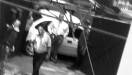

## Código Inicial
_175904 - Jorge III Altamirano Astorga (phil_websurfer@yahoo.com)_

```{r libraries, echo=TRUE, error=FALSE, message=FALSE, warning=FALSE}
library(readr)
library(dplyr)
library(magick)
library(imager)
library(purrr)
```

### Preparación de los datos

Con el fin de acelerar las lecturas e ingesta en R se precargan las columnas. El método reproducible lo hice en un script bash `col_types.sh`.

```{r leer tabla entrenamiento}
### Toma mucho tiempo por lo que se opta por guardar los objetos
  # col_types <- read_file("col_types.out")
  # df_train <- read_csv('train.csv', col_types = col_types, progress=F)
  # 
  # # Cambiar la última columna donde el estado se convierte en ID
  # col_types <- sub(pattern = "cT", replacement = "Ti", x = col_types)
  # df_test <- read_csv('test.csv', col_types = col_types, progress = F)
  # rm(col_types)
  # save(df_train, file = "df_train.Robj")
  # save(df_test, file = "df_test.Robj")

load(file = "df_train.Robj")
load(file = "df_test.Robj")
```

```{r}
table(df_train$estado)
```

## EDA

### Minuto del día, en vez de tipo "DateTime"

```{r rango de datos}
summary(df_train$hora)
summary(df_test$hora)
```


Considero que para nuestro análisis va a servir mejor si utilizamos los minutos del día dado que no hay estacionalidad al ser todas las muestras entre julio y agosto, aunque todo está en UTC.

```{r minutes conversion}
df_train$minutes <- (df_train[,38002]%>% 
  mutate(minutes = 60*as.integer(format(hora, format = '%H')) + 
           as.integer(format(hora, format = '%M'))))[,2]
df_train$minutes <- df_train$minutes$minutes
summary(df_train[,c(1,38000,38003)])
df_test$minutes <- (df_test[,c(38001)]%>% 
  mutate(minutes = 60*as.integer(format(hora, format = '%H')) + 
           as.integer(format(hora, format = '%M'))))[,2]
df_test$minutes <- df_test$minutes$minutes
summary(df_test[,c(1,38000,38003)])
hist(df_train$minutes)
hist(df_test$minutes)
# mutate(minutes = 60*as.integer(format(df_test$hora, format = "%H")) +
#   as.integer(format(df_test$hora, format = "%M")))
```

```{r}
mostrar_imagen <- function(renglon, dat, nrow = 190, ncol = 200){
  # head -n 1 train.csv | tr ',' '\n' | awk '{printf("%010d %s\n", NR, $0)}' | less
  v <- as.numeric(dat[renglon,c(1:(nrow*ncol))])
  mat <- (t(matrix(v, nrow=nrow, ncol=ncol, byrow=T))[,nrow:1])
  image(mat, axes = F, col=gray(0:255/255))
}


imagen <- mostrar_imagen(2, df_train, 190, 200)
df_train[2,38001]
```

#### Conversión de imágenes
```{r Conversión de imágenes a archivos}
convertir_imagen <- function(renglon, dat, nrow = 200, ncol = 190) {
# Usage: convertir_imagen(2, df_train)
  mat <- (t(matrix(as.numeric(dat[renglon,c(1:(nrow*ncol))]),
                   nrow=ncol, ncol=nrow, byrow=T))[,1:ncol])
  imagen <- as.cimg(mat)
  if(names(dat[1,38001]) == "estado") {
    filename <- paste0("tmp/",substitute(dat),"-",renglon,"-",dat[renglon,38001],".jpg")
  } else{
    filename <- paste0("tmp/",substitute(dat),"-",renglon,".jpg")
  }
  save.image(imagen, filename)
}

for(i in 1:nrow(df_train)) {
  convertir_imagen(i, df_train)
}
for(i in 1:nrow(df_test)) {
  convertir_imagen(i, df_test)
}
rm(i)
```

### Sacar las columnas de las secciones relevantes

Crée una función sencilla para extraer secciones que yo considero relevantes para el aprendizaje.

```{r secciones de la imagen}
submatrix <- function(x = 0, y = 0, xoffset = 0, yoffset = 0, nrow = x) {
  a = NULL
  for(i in 1:y) {
    for(j in 1:x) {
      a = c(a,(xoffset+j)+(nrow*(i+yoffset-1)))
    }
  }
  a
}
submatrix(2,5,2,2)
submatrix(3,2,3,1,6)

convertir_imagen2 <- function(renglon, dat, nrow = 200, ncol = 190) {
  mat <- (t(matrix(as.numeric(dat[renglon,c(1:length(dat[renglon,]))]),
                   nrow=ncol, ncol=nrow, byrow=T))[,1:ncol])
  imagen <- as.cimg(mat)
  filename <- paste0("tmp/test-",renglon,".jpg")
  save.image(imagen, filename)
}

a = submatrix(132,75,45,87,200)
a = submatrix(8,8,45,87,200)
# a = submatrix(200, 190, 0, 0, 200)
convertir_imagen2(1, df_train[51,a], 132, 75) ; 

pixels_average <- function(dat, renglon, size = 2, x = 0, y = 0, xoffset = 0, yoffset = 0, nrow = x) {
  # subimage <- submatrix(x, y, xoffset, yoffset, nrow)
  # dat <- dat[renglon, subimage]
  
  out <- NULL
  for(i in 1:(floor(x/size)-0)) {
    for(j in 1:(floor(y/size)-0)){
      out <- c(out,c(dat[submatrix(size, size, size*(j-1), size*(i-1), nrow)], ","))
    }
  }
  # subm <- submatrix(size, size, )
  # a = c(round(sum(dat)/size^2))
  out
}
b <- pixels_average(a, 51, 2, 4, 4, 0, 0, 8); b; a
# b = pixels_average(2, df_train[51,submatrix(2,2,95,120,200)])
```


```{r}
mostrar_imagen(100, df_train)
```

```{r}
mostrar_imagen(190, df_train)
```

```{r}
mostrar_imagen(130, df_train)
```

