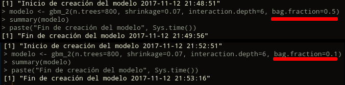

## {.tabset}

```{r libraries, message=FALSE, warning=FALSE}
library(rgeos)
library(maptools)
library(maps)
library(gbm)
library(kknn)
library(Hmisc)
library(glmnet)
library(magrittr)
```

### Datos

Consideraremos otro problema de predicción de valor de casas en el estado
de California. Necesitaremos estos dos paquetes para hacer gráficas

Opcional: haz el ejercicio con los paquetes xgboost y pdp.

La descripción de los datos es:

&P Letters Data
We collected information on the variables using all the block groups in California from the 1990 Census. In this sample a block group on average includes 1425.5 individuals living in a geographically compact area. Naturally, the geographical area included varies inversely with the population density. We computed distances among the centroids of each block group as measured in latitude and longitude. We excluded all the block groups reporting zero entries for the independent and dependent variables. The final data contained 20,640 observations on 9 variables. The dependent variable is ln(median house value).

INTERCEPT	
MEDIAN INCOME	
MEDIAN INCOME2	
MEDIAN INCOME3	
ln(MEDIAN AGE)	
ln(TOTAL ROOMS/ POPULATION)	
ln(BEDROOMS/ POPULATION)	
ln(POPULATION/ HOUSEHOLDS)	
ln(HOUSEHOLDS)		

The file cadata.txt contains all the the variables. Specifically, it contains median house value, median income, housing median age, total rooms, total bedrooms, population, households, latitude, and longitude in that order. 

Reference

Pace, R. Kelley and Ronald Barry, Sparse Spatial Autoregressions, Statistics and Probability Letters, 33 (1997) 291-297.

Puedes encontrar los datos en la carpeta datos del repositorio (california_housing)


Podemos ver la ubicación de los block groups:

```{r}
data <- read.table("../../../datos/california_housing/cadata.txt", skip=27, sep="",
    strip.white=TRUE)
nrow(data)
names(data) <- c("med_value","med_income","housing_med_age",
    "total_rooms","total_bedrooms",
    "pop","households","lat","long")

map('county','california')
points(data$long, data$lat,cex=0.2)           
nrow(data)
```

Podemos normalizar algunas variables y cambiar unidades para que sea más fácil
interpretar

```{r}
#promedio de cuartos por hogar
data$ave_room <- data$total_rooms/data$households
data$ave_bedroom <- data$total_bedrooms/data$households
# escalado de  valor (cientos de miles de dólares)
data$med_value_scaled <- data$med_value/100000
#promedio de número de habitantes por número de hogares
data$ave_occupancy <- data$pop/data$households 
#ojo: gbm usa el orden de los datos
set.seed(122323)
data_f <- data[sample(1:nrow(data), nrow(data)),]
```


### Pregunta 1

* Discute validación y prueba

Separamos datos de entrenamiento y prueba (vamos a usar validación cruzada
para seleccionar modelos):

```{r}
data_f_valid <- data_f[1:4000,]
data_f_train <- data_f[4000:20640, ]
```

_Considerando esta separación: observo que es diferente, aunque similar en el valor medio de las casas `med_value` tanto en los promedios, como en los mínimos. Por lo que podríamos decir que estamos utilizando solo una sección de los datos._

```{r}
"Validación"
summary(data_f_valid)
dim(data_f_valid)
"Entrenamiento"
summary(data_f_train)
dim(data_f_train)
rm(data_f_train, data_f_valid)
```

_Utilizando una muestra aleatoria._

```{r}
set.seed(175904)
sample <- sample(1:nrow(data_f), 4000)
data_f_valid2 <- data_f[sample,]
data_f_train2 <- data_f[-sample, ]
rm(sample)
"train"
summary(data_f_train2)
dim(data_f_train2)
"valid"
summary(data_f_valid2)
dim(data_f_valid2)
```

_En este caso observo mejores valores, por lo que utilizaría mejor este división, dado que no es una serie de tiempo. De acuerdo a lo comentado en clase._

¿Crees que habría una mejor manera de separar estos datos en entrenamiento y prueba? 

_Sí, de acuerdo a lo comentado._

Recuerda que esto depende de la tarea de predicción que buscamos hacer (lee también la descripción
de los datos). 

_Sí, observe que el valor a predecir es `media_house_value` ó `med_value`_

¿Cómo cambiaría tu estrategia de estimación si tus datos fueran a nivel de hogar (y no a nivel de *block group*, que es una
agrupación de manzanas, como en este ejemplo)?

_Cambiaría mucho respecto a la precisión que pudiéramos obtener, y con información adicional, incluso se va a poder obtener información de qué manzanas tienen costos mucho más dispares respecto a una y otra. Por ejemplo, que tengan una gran varianza entre propiedades de la misma manzana._

### Pregunta 2

* Ajusta un modelo de gradient boosting

Puedes utilizar una función como la que sigue. Utilizamos como medida de error
el error absoluto medio (por eso ponemos `laplace` en *distribution*):

```{r gbm_2}
gbm_2 <- function(n.trees, shrinkage, interaction.depth, bag.fraction, cv.folds=10){
    fit_boost <- gbm(med_value_scaled ~ med_income + households + lat + long + ave_room + ave_bedroom + housing_med_age + ave_occupancy,
            data=data_f_train2,
            n.trees=n.trees,
            distribution="laplace",
            shrinkage=shrinkage,
            interaction.depth = interaction.depth,
            bag.fraction = bag.fraction,
            train.fraction=1,
            n.minobsinnode = 10,
            cv.folds=cv.folds,
            keep.data=TRUE,
            verbose=FALSE
            )
    fit_boost
}
```

Corre un modelo con 800 árboles, tasa de aprendizaje de 0.07, profundidad 6
y bag.fraction (submuestreo) de 0.5:

```{r}
paste("Inicio de creación del modelo", Sys.time())
modelo <- gbm_2(n.trees=800, shrinkage=0.07, interaction.depth=6, bag.fraction=0.5)
summary(modelo)
paste("Fin de creación del modelo", Sys.time())
```

Puedes graficar el error de validación cruzada con

```{r}
gbm.perf(modelo)
plot(modelo$cv.error[-c(1:10)], type="l") # (opcional) quitar las primeras 10 iteraciones.
```

### Pregunta 3

* Intenta no usar bag.fraction

En este ejemplo, ¿Qué pasa con el error de validación cruzada en el ejemplo anterior si no usas submuestreo? ¿Cuánto tiempo tarda en correr en comparación al modelo anterior? 

```{r}
paste("Inicio de creación del modelo", Sys.time())
modelo <- gbm_2(n.trees=800, shrinkage=0.07, interaction.depth=6, bag.fraction=0.1)
summary(modelo)
paste("Fin de creación del modelo", Sys.time())
```

_Los tiempos fueron distintos, aunque no pude poner `bag.fraction=0`. Aquí muestro la diferencia_


### Pregunta 4

* Tasa de aprendizaje demasiado alta

Intenta poner la tasa de aprendizaje más alta (por ejemplo 0.5) En este ejemplo, ¿Qué pasa
con el error de validación cruzada?

```{r shrink alto}
modelo <- gbm_2(n.trees=800, shrinkage=0.40, interaction.depth=6, bag.fraction=0.5)
```


```{r}
gbm.perf(modelo)
plot(modelo$cv.error[-c(1:10)], type="l") # (opcional) quitar las primeras 10 iteraciones.
```


### Pregunta 5

* Refina tu modelo

Intenta hacer shrinkage un poco más chico y correr el modelo con más iteraciones (n.trees).
¿Qué tan chico pudiste hacer el error de validación cruzada? Si haces
shrinkage muy chico, ¿qué tienes qué hacer con el número de árboles (n.trees) para
obtener buen desempeño?

```{r}
modelo <- gbm_2(n.trees=800, shrinkage=0.20, interaction.depth=6, bag.fraction=0.5)
summary(modelo)
gbm.perf(modelo)
plot(modelo$cv.error[-c(1:10)], type="l")
```

_Aquí aumenté el número de árboles, con el siguiente resultado_

```{r}
modelo <- gbm_2(n.trees=1000, shrinkage=0.20, interaction.depth=6, bag.fraction=0.5)
summary(modelo)
gbm.perf(modelo)
plot(modelo$cv.error[-c(1:10)], type="l")
```

### Pregunta 6

* Evalúa el modelo que seleccionaste

Calcula con la muestra de prueba nuestra estimación final del error de predicción (recuerda usar el error absoluto promedio). Compara con regresión lineal. Haz una gráfica de predicciones de prueba contra valores observados. Calcula el valor en dólares de los 10\% más grandes de los errores de prueba y del 10\% de los errores más chicos (usa la función quantile).

```{r Linear Regression}
lm_lineal <- function(){
  cv.glmnet(
    x = data_f_train2[,which(names(data_f_train2) %in% 
            c("households", "lat", "long", "ave_room", "ave_bedroom", "housing_med_age", "ave_occupancy"))]%>%as.matrix,
    y = data_f_train2$med_value_scaled,
    alpha = 1, type.measure = "mae" )

}
# summary(data_f_train2)
modelo_lm <- lm_lineal()
1-modelo_lm$lambda.1se
```

```{r}
plot(modelo_lm$cvm)
```

_Comparando los errores mínimos observamos que nos fue mejor con `gbm`_

```{r}
modelo_lm$cvm[modelo_lm$lambda == modelo_lm$lambda.min]
modelo$cv.error[modelo$cv.error == min(modelo$cv.error)]
```


### Pregunta 7

* Importancia de variables y gráficas de dependencia parcial

- Usa la función `summary` para obtener las importancias relativas de las variables
(en este caso, son de tipo gini, y están normalizadas para sumar 1).

_Se realizaron estas pruebas en cada uno, y por eso escogí el modelo_
```{r}
summary(modelo)
```

- ¿Cómo es la gráfica de dependencia parcial del ingreso mediano?

```{r}
# summary(
#   data_f_train2[,which(names(data_f_train2) %in% 
#             c("med_value_scaled", "med_income"))]
# )
plot(data_f_train2[,which(names(data_f_train2) %in% 
            c("med_value_scaled", "med_income"))])
plot(modelo, i.var=c(1,5))
summary(modelo)
```


- ¿Cómo es la gráfica de dependencia parcial de la variable households? ¿Qué puedes
decir de la variación que ves para valores grandes de households? (Considera dónde está la mayoría de los datos de household). ¿Cómo rediseñarías esta gráfica si quisieras presentarla para explicar el efecto de esta variable?

- Usualmente, latitud y longitud sólo tiene sentido considerarlas juntas en una gráfica de 
dependencia parcial (como interacción). Haz la gráfica de dependencia parcial para estas dos variables

```{r}
# Latitud y longitud sólo tienen sentido como interacción
plot(modelo, i.var=c(4,3))
```

Sobrepone al mapa para entender esta relación. Puedes usar el siguiente
código:

```{r, fig.width=5, fig.height=6}
# fit_boost es el modelo final que ajustaste
# obtener los datos de la gráfica de dependencia parcial
grid_pos <- plot(modelo, i.var=c(4,3), n.trees=1000, return.grid=TRUE)

# Calcular con 1 vecino más cercano el valor de dependencia parcial
# para cada caso de entrenamiento (no son los mismos valores)
knn_1 <- kknn(y~long+lat, grid_pos, data_f_train2[ , c("long","lat")], k=1,
    kernel="rectangular")
data_f_train2$lat_long_partial <- knn_1$fitted.values
# Cortar para obtener colores
data_f_train2$lat_long_partial_cat <- cut2(data_f_train2$lat_long_partial, g=10)
plot(data_f_train2$long, data_f_train2$lat,
     col=rev(heat.colors(10, alpha=0.8))[data_f_train2$lat_long_partial_cat], pch=16,
        cex=0.8)
map('county','california', add=TRUE, col="gray80")
```

¿Cuáles son las zonas más caras de California?

_Las zonas costeras. En particular: (en el siguiente orden)_

++ _San Francisco Bay Area_
++ _Los Angeles Basin_
++ _San Diego_

_A mí me sorprendió que no figurara Lake Tahoe o Sacramento_
